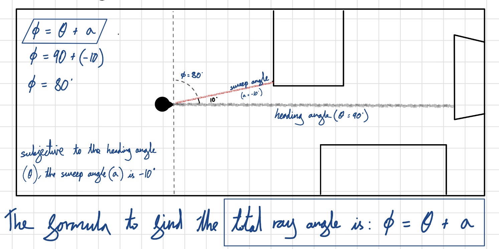
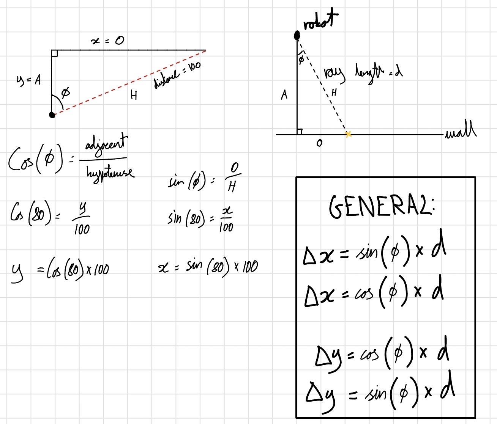

# 13/09/26

* **Sensor Angle Offset ($\phi = \theta + \alpha$)**:
  * Global ray angle $\phi$ is the sum of body heading $\theta$ and local sensor sweep angle $\alpha$.
  * Converts local sensor-frame readings into global world-frame vectors.

* **Vector Components (SOH CAH TOA)**:
  * Sensor range distance $d$ acts as the triangle hypotenuse $H$.
  * Horizontal component: $\Delta x = d \cdot \cos(\phi)$
  * Vertical component: $\Delta y = d \cdot \sin(\phi)$
  * **Rule**: Always multiply hypotenuse $d$ by $\cos/\sin$; never divide.

* **Global Hit Point Formula**:
  * $x_{\text{hit}} = x_{\text{robot}} + d \cdot \cos(\phi)$
  * $y_{\text{hit}} = y_{\text{robot}} + d \cdot \sin(\phi)$
  * Must add robot center coordinates $(x_{\text{robot}}, y_{\text{robot}})$ to offset from screen origin.

* **Coordinate Frame Shift (Math vs. Pygame)**:
  * Math grid: $Y$ increases UP, positive angles rotate Counter-Clockwise.
  * Pygame grid: $Y$ increases DOWN, positive angles rotate Clockwise.
  * SOH CAH TOA math remains identical in code despite the inverted $Y$-axis.

---

### 2. Hand-Drawn Math Proofs

These iPad sketches verify the vector math and show how pure geometry translates into screen coordinates:

#### Total Ray Angle Derivation
*Proving how local sensor sweep angles offset from the robot's body heading.*

#### Raycasting & SOH CAH TOA Derivation
*Proving vector resolution using right-angled triangles to find collision coordinates.*

---
